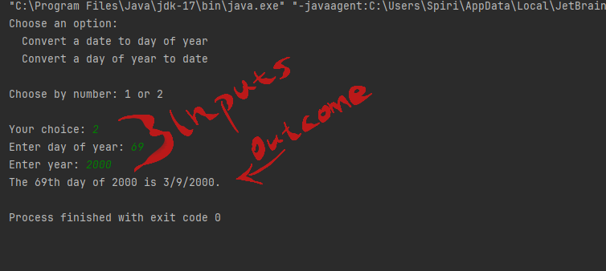

# 📅 CalendarHelper

##### Java Demo Project – Date Conversion Utility

 
 
 
Presented by [Spyridon Mavrommatis] • 2025

---

## 🎯 Project Goals

 
 

- **Convert dates to day-of-year** (e.g., 30, 6, 2045 → 181st of the year)
   
- **Convert day-of-year back to full date** (e.g., 69, 2000 → 2/9/2000)

---

## 🖥️ Example 1 Output

---

## 🖥️ Example 2 Output

---

## 🧱 Project Structure

###### The code is organized in a **modular way** using multiple Java classes:

- **`Main.java`** → _The Orchestrator_
- **`DisplayHelper.java`** → _The Director_
- **`DateConverter.java`** → _The Parser_
- **`MathUtils.java`** → _The Worker_
- **`DateConstants.java`** → _The Reference Library_  
   
  See: `calendar_modules_architecture.png`

---

---
